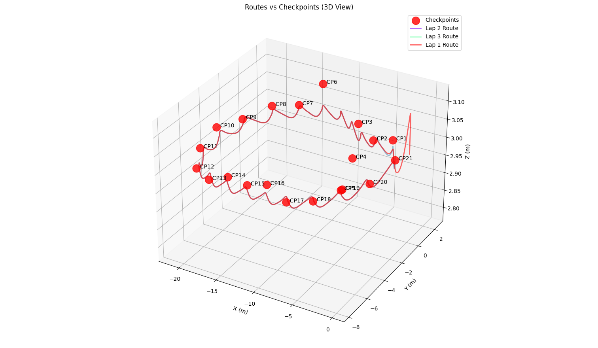
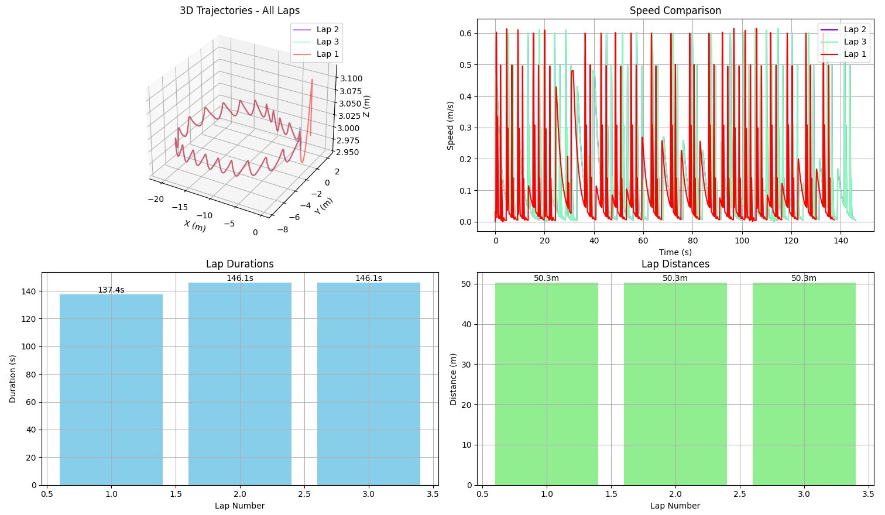

# Autonomous Parkour Drone

An advanced autonomous quadcopter system designed to navigate through parkour courses with optimal path planning, and comprehensive data analysis. Built on the Webots robotics simulation platform using a Crazyflie drone.


## 🎬 Demo Video


## Project Overview

This project develops an autonomous quadcopter system capable of completing predefined parkour courses in minimum time by navigating through checkpoints. The system combines advanced sensor fusion, intelligent path planning, and precision control algorithms to achieve optimal performance.

### Key Features

- **Autonomous Navigation**: Complete autonomous flight through complex parkour courses
- **Checkpoint Detection**: Real-time LiDAR-based obstacle and checkpoint detection
- **Intelligent Pathfinding**: A* algorithm implementation for optimal route planning
- **Data Analytics**: Comprehensive sensor data logging and performance analysis
- **Manual Control**: Full manual flight control for training and testing
- **Visualization**: Advanced 3D route visualization and performance charts
- **Multi-lap Support**: Automated multi-lap course completion with timing

## System Architecture

### Core Components

```
controllers/main_controller/
├── main_controller.py      # Main entry point and control loop
├── octopus.py             # Drone control class with flight functions
├── pid_controller.py      # PID control system for stability
├── key_controller.py      # Manual control and course automation
├── checkpoint_manager.py  # Checkpoint detection and management
├── pathfinding.py         # A* pathfinding algorithm
├── route_recorder.py      # Route data recording system
├── route_visualizer.py    # Data visualization and analysis
├── passage_point.py       # Checkpoint passage filtering
└── checkpoints_charts.py  # Checkpoint data visualization
```

### Sensor Suite

- **GPS**: Precise positioning and navigation
- **IMU**: Attitude estimation (roll, pitch, yaw)
- **Gyroscope**: Angular velocity measurements
- **LiDAR (4x)**: 360° obstacle detection (front, back, left, right)
- **Camera**: Visual feedback and monitoring

## Getting Started

### Prerequisites

- **Webots R2025a** or newer
- **Python 3.x**
- **Required Python packages**:
  ```bash
  pip install numpy matplotlib json datetime math
  ```

### Installation

1. **Clone the repository**:
   ```bash
   git clone https://github.com/ErsaGunTosun/autonomous-parkour-drone.git
   cd autonomous-parkour-drone
   ```

2. **Open in Webots**:
   - Launch Webots
   - Open `worlds/Parkour.wbt`
   - The simulation will automatically load the drone and parkour course

3. **Run the simulation**:
   - Press the play button in Webots
   - The drone will automatically initialize and hover

## Controls & Usage

### Manual Control Mode

| Key | Action |
|-----|--------|
| `W` / `S` | Increase / Decrease altitude |
| `A` / `D` | Move left / right |
| `↑` / `↓` | Move forward / backward |
| `←` / `→` | Turn left / right |
| `R` | Start/Stop checkpoint recording |
| `C` | Start automated course with checkpoints |
| `X` | Reset checkpoints |
| `V` | Visualize checkpoint data |
| `Q` | Quit |

### Automated Operation Modes

#### 1. Checkpoint Recording Mode
```bash
# Press 'R' to start recording checkpoints
# Fly manually through the course
# Press 'R' again to stop recording
```

#### 2. Autonomous Course Mode
```bash
# Press 'C' to start autonomous course completion
# The drone will automatically navigate through recorded checkpoints
# Supports multiple laps with performance tracking
```

## Technical Details

### Flight Control System

The drone uses a sophisticated PID control system with:

- **Altitude Control**: Maintains precise height with integral windup protection
- **Velocity Control**: Smooth movement in 3D space
- **Attitude Stabilization**: Roll, pitch, and yaw control
- **Position Tracking**: GPS-based waypoint navigation

### Checkpoint Detection Algorithm

```python
# LiDAR-based checkpoint detection
if left_distance < THRESHOLD or right_distance < THRESHOLD:
    # Detect checkpoint passage
    # Filter and validate checkpoint
    # Record optimal passage point
```

### Pathfinding System

The A* algorithm implementation includes:
- **Node connections**: Automatic checkpoint connectivity
- **Optimal routing**: Shortest path calculation
- **Dynamic optimization**: Real-time path adjustments

### Data Recording

Each flight session records:
- **Position data**: 3D coordinates with timestamps
- **Orientation**: Roll, pitch, yaw angles
- **Velocity**: 3D velocity vectors
- **Sensor readings**: LiDAR distances
- **Performance metrics**: Speed, acceleration, stability

## Data Analysis & Visualization

### Performance Analytics

The system provides comprehensive analysis:

```python
# Load and analyze route data
python -c "
from route_visualizer import visualize_route, analyze_performance
visualize_route()  # All laps
analyze_performance()  # Performance metrics
"
```

### Available Visualizations

1. **3D Flight Trajectories**: Complete route visualization
2. **Speed Profiles**: Velocity analysis over time
3. **Orientation Tracking**: Attitude stability analysis
4. **LiDAR Data**: Obstacle detection patterns
5. **Lap Comparisons**: Multi-lap performance comparison
6. **Checkpoint Analysis**: Checkpoint passage optimization

### Sample Output

```
=== Performance Analysis ===
Lap 1 Analysis:
  Duration: 45.2s
  Total Distance: 156.8m
  Average Speed: 3.47 m/s
  Max Speed: 5.21 m/s
  Checkpoint Times: [12.3s, 24.1s, 36.8s, 45.2s]
```

## Results & Visualizations

### Flight Trajectory Analysis

<div align="center">

#### 3D Route Visualization

*Drone'un 3 boyutlu uçuş rotası ve checkpoint'lerin konumları*

#### Performance Comparison

*Çoklu tur performans karşılaştırması ve iyileştirme trendi*

</div>


## Data Storage

The system automatically saves:

- `checkpoints.json`: Checkpoint positions and metadata
- `route_data_lap_X.json`: Detailed flight data for each lap
- Performance logs and analysis results

### Data Structure

```json
{
  "lap_number": 1,
  "start_time": "2025-01-XX",
  "checkpoint_times": {...},
  "points": [
    {
      "timestamp": 0.0,
      "position": [x, y, z],
      "orientation": [roll, pitch, yaw],
      "velocity": [vx, vy, vz],
      "lidar_readings": {...}
    }
  ]
}
```

## Performance Features

### Multi-Lap System
- Automated multi-lap course completion
- Configurable lap count (default: 3 laps)
- Real-time lap timing and statistics
- Performance comparison between laps

### Optimization Features
- **Smooth Trajectory Planning**: Minimizes sharp turns
- **Stabilization Control**: Maintains flight stability
- **Checkpoint Optimization**: Optimal passage point detection

## Configuration

### Flight Parameters (in `octopus.py`)

```python
FLYING_ATTITUDE = 3.0        # Default hover altitude (m)
TARGET_THRESHOLD = 0.1       # Position accuracy (m)
MAX_VELOCITY = 1.0           # Maximum flight speed (m/s)
LIDAR_THRESHOLD = 0.5        # Checkpoint detection threshold (m)
```

### PID Controller Gains (in `pid_controller.py`)

```python
gains = {
    "kp_att_y": 1,           # Yaw proportional gain
    "kd_att_y": 0.5,         # Yaw derivative gain
    "kp_att_rp": 0.5,        # Roll/Pitch proportional gain
    "kd_att_rp": 0.1,        # Roll/Pitch derivative gain
    "kp_vel_xy": 2,          # Velocity proportional gain
    "kd_vel_xy": 0.5,        # Velocity derivative gain
    "kp_z": 10,              # Altitude proportional gain
    "ki_z": 5,               # Altitude integral gain
    "kd_z": 5                # Altitude derivative gain
}
```

## Course Design

The parkour course (`worlds/Parkour.wbt`) features:
- **Circular obstacles**: Red pipe checkpoints for navigation
- **Complex geometry**: Requires precise maneuvering

## Research Applications
This project serves as a platform for:
- **Autonomous navigation research**: Path planning algorithms
- **Control system development**: PID and advanced controllers
- **Sensor fusion studies**: Multi-sensor integration
- **Performance optimization**: Flight efficiency analysis
- **Machine learning**: Data collection for AI training
